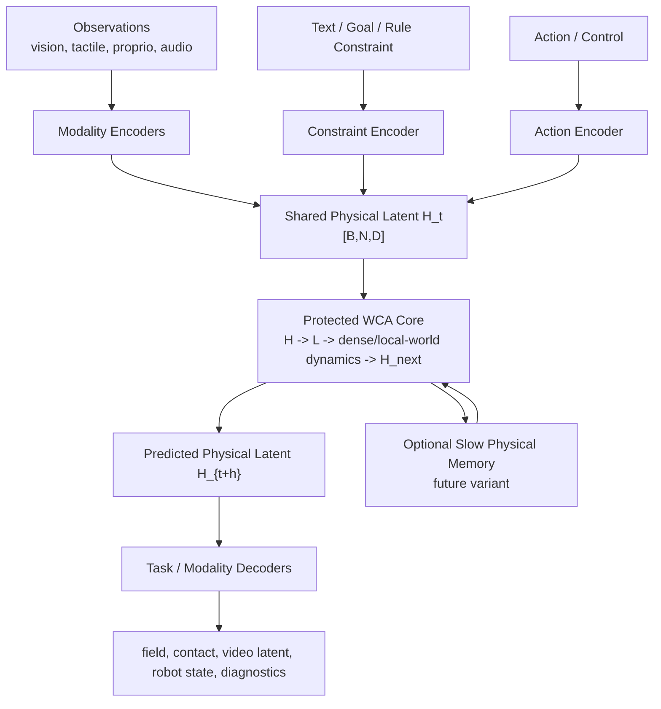

# Unified Physical Latent Design

## Status

- Bucket: D. Future branch
- Stage: not active training
- Current action: design record only
- Promotion prerequisite: current PDE/field mainline must pass attribution, capacity-safe scaling, rollout, and more-PDE-family gates.

This document records the unified physical latent direction so it is not lost, but it must not interrupt the active V28b -> recursion ladder -> rollout line.

## Core Claim

WCA should eventually operate on a shared physical latent state rather than modality-specific raw inputs.

```text
vision / tactile / proprio / audio / text constraints / actions
  -> modality encoders
  -> shared physical latent H_t
  -> WCA transition
  -> H_{t+h}
  -> modality/task decoders
```

Allowed near-term claim:

```text
WCA can be tested as a structured physical latent transition model.
```

Not allowed yet:

```text
WCA is already a full multimodal world model.
WCA already beats JEPA/V-JEPA/RSSM/ConvGRU world models.
```

## System Architecture



The WCA core remains protected. Encoders, decoders, memory, hierarchy, and latent scratchpads are wrappers or variants.

## Latent State Schema

The shared physical latent should be structured enough to support intervention and guardrails.

Candidate channel groups:

| Group | Meaning | Example Observables | Main Risk |
|---|---|---|---|
| geometry | position, pose, topology, boundary | coordinates, masks, surfaces | semantic-only collapse |
| velocity | local and object-level motion | optical flow, finite difference | noisy derivative shortcuts |
| material | mass, stiffness, elasticity, friction, viscosity | material id, tactile response | non-identifiability |
| force/contact | contact mask, force, slip | tactile grids, collision events | simulator-only artifact |
| uncertainty | occlusion, confidence, missingness | masks, sensor dropout | uncertainty ignored |
| agent/action | controllable state and action | robot joints, controls | policy leakage |
| memory | history-dependent belief state | delayed observations, hidden state | future leakage |

## Planned Module Boundaries

These are proposed paths, not active implementation.

| Module | Planned Path | Responsibility | Inputs | Outputs |
|---|---|---|---|---|
| Modality encoders | `src/wca/models/physical_latent/encoders.py` | Map raw modalities into cell-local physical features | images, tactile grids, proprio, audio | partial `H_t` channels |
| Constraint encoder | `src/wca/models/physical_latent/constraints.py` | Encode text/rules/goals as conditions, not text targets | material text, goal, rule | condition channels |
| Latent schema | `src/wca/models/physical_latent/schema.py` | Define channel groups and masks | config | channel indices, guards |
| WCA wrapper | `src/wca/models/physical_latent/wca_wrapper.py` | Compose encoders with protected WCA core | batch dict | `H_{t+h}` |
| Decoders | `src/wca/models/physical_latent/decoders.py` | Decode latent state into task outputs | `H_{t+h}` | field/contact/state/video latent |
| Guardrails | `src/wca/eval/physical_latent_guardrails.py` | Test leakage, intervention, cross-modal alignment | checkpoints + eval data | report rows |

## Minimal Validation Ladder

### L0: Structural Gate

Required before training:

- no model file imports dataset generator or oracle;
- explicit latent channel schema;
- no future frame, target field, contact label, or oracle path in model input;
- shape contract for `H [B,N,D]`;
- protected WCA baseline untouched.

### L1: Toy Physical Latent

Small controlled tasks:

- 2D collision toy world;
- material-conditioned diffusion;
- occlusion and later correction;
- text-as-constraint for material/rule, not text generation.

Success:

```text
latent intervention changes downstream dynamics in the expected direction
and encoder-only / decoder-only controls do not match full WCA.
```

### L2: Cross-Modal Contact Alignment

Inputs:

- visual event;
- tactile/contact pulse;
- optional audio/proprio event.

Metrics:

- contact F1 / IoU;
- force or pressure error;
- timing error;
- latent alignment under held-out materials.

### L3: JEPA-Style Comparison

Compare:

- WCA physical latent transition;
- JEPA-style latent predictor;
- RSSM / ConvGRU;
- U-Net/FNO for field-only tasks.

Required metrics:

- masked latent prediction;
- rollout stability;
- intervention response;
- planning/control proxy;
- wall-clock and parameter count.

## Guardrail Matrix

| Risk | Guardrail |
|---|---|
| encoder predicts target alone | encoder-only / tokenizer-only control |
| decoder is too strong | decoder capacity sweep and frozen decoder control |
| language shortcut | text shuffle / rule contradiction probes |
| modality leakage | per-modality future-label sentinel |
| latent collapse | channel intervention and mutual-information diagnostics |
| world-model overclaim | require rollout, intervention, and JEPA/RSSM comparison |

## Promotion Criteria

Promote this branch from D to A only if:

1. current PDE/field WCA mainline passes attribution and scaling gates;
2. V28b or successor proves WCA core contribution survives interface controls;
3. rollout tests show stable long-horizon signal beyond direct prediction;
4. a minimal toy physical-latent task is defined with strong negative controls;
5. JEPA/RSSM/ConvGRU baseline recipes are specified before claims.

## Immediate Non-Goals

- Do not add unified physical latent to the current V28b queue.
- Do not claim multimodal world-model capability from PDEBench MSE.
- Do not mutate `FullRecursiveWorldStateNCA`.
- Do not train text-token generation.
- Do not add memory or latent CoT until rollout guardrails exist.

## Current Next Step

Wait for V28b. Then run:

```text
V28b interface attribution
-> capacity-safe recursion ladder
-> rollout
-> more PDE families
-> decide whether to promote unified physical latent
```
