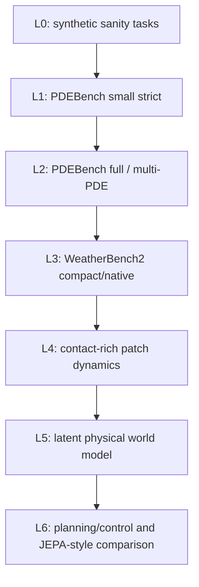

# WCA Experiment Constitution And Macro Plan

Date: 2026-06-23

Status: mandatory research protocol for V23+.

This document defines the experiment principles for WCA. Its purpose is to stop
ad-hoc experiment growth and convert the project into a claim-gated research
program.

## External Standards Used As Design Inputs

This project is not trying to copy another benchmark, but it should inherit the
most useful principles from mature research practice:

- **NeurIPS reproducibility practice**: code policy, checklists, and workflow
  discipline reduce accidental errors and improve reliability.
- **ACM artifact review and badging**: formal claims require software, scripts,
  input data, raw experimental data, and analysis scripts that can be audited.
- **MLPerf / MLCommons benchmarking**: quality targets, wall-clock time,
  hardware metadata, rules, and result-change logs should be separated from
  model-quality claims.
- **NIST AI RMF**: use a governance loop: map the claim, measure it, manage
  failure modes, and keep oversight/provenance.
- **WeatherBench2 / PDEBench**: open data, fixed splits, baseline ladders,
  headline metrics, caveat reporting, and benchmark-specific evaluation are more
  valuable than one-off MSE tables.
- **JEPA / V-JEPA-style world-model work**: world-model claims require
  self-supervised predictive training, downstream evaluation, planning or
  control evidence, and comparison against strong latent-prediction baselines.

Reference links:

- NeurIPS reproducibility program: <https://arxiv.org/abs/2003.12206>
- ACM artifact review and badging: <https://www.acm.org/publications/policies/artifact-review-and-badging-current>
- MLPerf Training benchmark: <https://mlcommons.org/benchmarks/training/>
- NIST AI RMF: <https://www.nist.gov/itl/ai-risk-management-framework>
- WeatherBench2: <https://arxiv.org/abs/2308.15560>
- PDEBench: <https://arxiv.org/abs/2210.07182>
- V-JEPA 2: <https://arxiv.org/abs/2506.09985>

## Core Principle

WCA experiments must be claim-gated:

```text
paper claim
  -> falsifiable hypothesis
  -> strict experiment contract
  -> matched baselines
  -> raw and granular evidence
  -> statistical decision
  -> promote / probation / prune
```

If an experiment does not serve a claim, it should not consume major GPU time.

## Protected Algorithm Identity

The protected WCA reference remains Full Dense RWS-NCA:

```text
H: [B, N, D]
L: [B, N, N, D]
dense pair semantics: [B, N, N, N, D]
World -> Local Worlds -> World recursion
```

Rules:

1. FullDenseRWSNCA is the reference model, not the only future model.
2. Sparse, hybrid, low-rank, continuous, memory, and multimodal versions are
   variants.
3. No variant may silently replace the reference.
4. A scalable WCA may reduce computation only if it preserves the local-world
   distinction and does not collapse into ordinary GNN message passing over
   `H`.

## Paper Spine

The paper should not be "WCA ran many unrelated tasks." The central paper spine
is:

```text
WCA is a recursive world-field computation architecture.
It constructs local worlds, evolves them, and recomposes a global state.
This inductive bias can be validated on field dynamics, topology, and
world-model prediction tasks under strict matched baselines.
```

Everything else is supporting evidence.

## Main Claims

Each claim must have its own evidence gate.

| Claim ID | Claim | Required Evidence |
|---|---|---|
| C1 | WCA has a distinct recursive local-world mechanism. | shape invariants, ablations, reference/variant separation |
| C2 | WCA can learn useful physical field dynamics. | PDEBench/WeatherBench matched baselines |
| C3 | WCA has a long-horizon advantage under some conditions. | h4/h8/higher direct and rollout evidence |
| C4 | WCA short-horizon weakness is fixable or real. | fixed-h1, dt-conditioned, multihead, stratified-loss tests |
| C5 | locality/sparsity preserves or improves WCA capability. | dense vs support-sparse equivalence and quality/cost sweeps |
| C6 | WCA can be a world-model component. | latent prediction, rollout, planning/control, JEPA-style baselines |
| C7 | WCA scales predictably with width/depth/support. | scaling law, cost-aware scoring, hardware utilization reports |
| C8 | WCA artifacts are reproducible and auditable. | raw artifacts, configs, scripts, inventory, paired stats |

## Evidence Tiers

Use these labels in every report:

| Tier | Meaning | Allowed Language |
|---|---|---|
| E0 Exploratory | one-off run, incomplete controls | "signal", "hypothesis" |
| E1 Candidate | matched data/eval, limited seeds | "candidate effect" |
| E2 Formal | strict controls, paired rows, baselines, artifacts | "formal evidence in this setting" |
| E3 Paper-ready | repeated seeds, robustness slices, raw-complete artifacts | "main paper result" |
| E4 Replication-ready | independent rerun possible from artifacts | "artifact-supported result" |

No E0/E1 result may be written as a paper conclusion.

## Experiment Contract

Every experiment manifest must be able to answer these fields before submission:

```text
experiment_id:
claim_id:
hypothesis:
falsification_condition:
model_variants:
protected_reference:
non_wca_baselines:
dataset:
split_policy:
eval_plan:
primary_metric:
secondary_metrics:
statistical_test:
scoring_profile:
success_gate:
failure_action:
artifact_requirements:
compute_budget:
checkpoint_policy:
known_risks:
```

Missing fields mean the experiment is not eligible for formal evidence.

## Non-Negotiable Design Rules

1. **Claim first**: every run must serve a named claim.
2. **Falsifiable hypothesis**: every run must define what would disprove the
   hypothesis.
3. **Matched baselines**: same data, split, horizon, eval plan, checkpoint scope,
   and metric direction.
4. **Quality/cost separation**: quality metrics and efficiency metrics are
   scored separately before any combined score.
5. **No hidden best/final mixing**: best, final, and selected checkpoint rankings
   are separate tables.
6. **Granular rows required**: per-sample/per-horizon/per-variable/per-trajectory
   rows are required where applicable.
7. **No trajectory leakage**: sequence datasets must split by trajectory/group
   before window generation.
8. **No label leakage**: future targets, oracle paths, BFS labels, and target
   frames must not appear in model inputs.
9. **Artifact before claim**: a claim is not formal until required artifacts pass
   inventory.
10. **Mechanism before scale**: large training is only allowed after small strict
    mechanism gates pass.

## Benchmark Ladder

The project should move from low-risk mechanism tests to world-model claims:



Progression is gated. A branch may not jump to L5 if it fails L1/L2 for the
same claimed mechanism.

## Scoring System

Every formal comparison should produce three independent views:

1. **Quality score**
   - MSE / RMSE / relative L2 / spectral error / rollout error.
   - TOPSIS allowed only with a saved decision matrix.

2. **Cost score**
   - parameters, peak GPU memory, wall-clock time, samples/sec, GPU count.
   - This must not be mixed into quality-only rankings.

3. **Evidence score**
   - number of seeds;
   - paired bootstrap confidence intervals;
   - complete artifacts;
   - source/cache/split provenance;
   - robustness/failure slices.

Promotion decisions should use Pareto frontier plus a pre-registered TOPSIS
profile. If TOPSIS and Pareto disagree, the report must explain why.

## Statistical Rules

Formal reports must include:

- primary metric and direction;
- secondary metrics and direction;
- paired bootstrap confidence intervals when per-sample rows exist;
- seed count and seed list;
- checkpoint scope;
- exact eval plan id or hash;
- decision matrix for multi-criteria scoring;
- separate quality-only and cost-aware scores.

Default bootstrap rule:

```text
paired delta = WCA metric - baseline metric
negative is better for cost/error metrics
report mean delta and 95% bootstrap CI
```

## Compute Policy

Use compute in stages:

| Stage | Hardware Pattern | Purpose |
|---|---|---|
| Search | one GPU per task | fast branch screening |
| Formal small | one or more GPUs, fixed budget | matched baseline evidence |
| Scale | 8 GPUs or more | width/depth/support scaling |
| Distributed | multi-node only after single-node gates | throughput and memory scaling |

Do not use 8+ GPUs to compensate for unclear hypotheses.

## Artifact Policy

Formal experiments must save:

- resolved config;
- control manifest;
- queue manifest;
- train/eval logs;
- best/final/selected checkpoint metadata;
- `results.csv`;
- `results_by_horizon.csv` or task equivalent;
- `per_sample_rows.csv` or task equivalent;
- `eval_plan.json`;
- source/cache/split provenance;
- hardware profile;
- report markdown;
- artifact inventory;
- analysis script or notebook path.

Remote aggregation may produce compact CSV/XLSX reports, but raw granular rows
must remain fetchable and locally recomputable until remote analysis is audited.

## Macro Roadmap

### Phase 0: Constitution And Tooling

Goal:

```text
make experiment design strict enough that bad runs are blocked before GPU time
```

Deliverables:

- this document;
- manifest contract checks;
- TOPSIS decision-matrix export;
- paired bootstrap report helper;
- local analysis package rule.

### Phase 1: V23 Horizon-Mechanism Rescue

Question:

```text
Why does WCA show a strong h8 signal while h1/h2 are weak?
```

Runs:

- `wca_fixed_h1`
- `wca_fixed_h8`
- `wca_horizon_multihead`
- `wca_dt_conditioned`
- `wca_horizon_stratified_loss`
- FNO / U-Net / ConvNet / persistence baselines

Primary gate:

```text
balanced TOPSIS within 5-10% of FNO
and h8 statistically tied with or better than FNO
and h1/h2 no longer collapse
```

Failure action:

- If fixed-h1 fails, WCA short-horizon PDE weakness is real in this setting.
- If fixed-h1 works but mixed fails, the problem is horizon mixing/readout/loss.
- If h8 disappears, the prior h8 result was fragile.

### Phase 2: V24 Architecture Branch Selection

Question:

```text
Which WCA structural branch deserves scale?
```

Branches:

- FullDense reference;
- DenseMaskedGrid;
- SupportSparse;
- LowRankPair;
- HybridAnchor;
- ContinuousDtDx.

Primary gate:

```text
quality degradation <= 5-10% relative to best dense reference
and memory or speed improves materially
and paired statistics do not show hidden collapse
```

### Phase 3: V25 Formal PDE/Weather Bench

Question:

```text
Can the best WCA branch beat or match strong field baselines under strict
conditions?
```

Baselines:

- persistence;
- ConvNet;
- U-Net;
- FNO;
- selected neural operator baseline if available.

Metrics:

- MSE/RMSE/relative L2;
- spectral error;
- rollout error;
- per-variable/per-horizon/per-trajectory slices;
- quality-only and cost-aware rankings.

### Phase 4: V26 World-Model Expansion

Question:

```text
Can WCA become a world-model component rather than only a PDE predictor?
```

Directions:

- latent physical state prediction;
- JEPA-style latent predictor baseline;
- contact-rich patch dynamics;
- counterfactual material intervention;
- memory token / latent rollout scratchpad;
- planning/control probe.

Primary rule:

```text
do not claim world-model capability from direct MSE alone
```

Required evidence:

- rollout stability;
- latent consistency;
- intervention response;
- planning/control proxy;
- comparison against JEPA-style or RSSM/ConvGRU baselines.

### Phase 5: V27 Scale And Paper Readiness

Question:

```text
Does the selected WCA branch scale in quality, data, horizon, and hardware?
```

Required:

- width/depth/support scaling;
- 8-GPU or larger utilization;
- checkpoint restore;
- repeated seeds;
- raw-complete artifacts;
- paper tables generated from scripts.

## V23 Formal Experiment Template

```yaml
experiment_id: v23_horizon_mechanism_rescue
claim_id: C3_C4
hypothesis: >
  WCA's h1/h2 weakness is caused by horizon mixing/readout/loss design, not by
  an inherent inability to predict short physical horizons.
falsification_condition: >
  Fixed-h1 and dt-conditioned WCA fail against persistence and strong baselines
  under paired strict evaluation.
model_variants:
  - wca_fixed_h1
  - wca_fixed_h8
  - wca_horizon_multihead
  - wca_dt_conditioned
  - wca_horizon_stratified_loss
non_wca_baselines:
  - persistence
  - convnet_mixed
  - unet_mixed
  - fno_mixed
primary_metric: horizon_stratified_mse
secondary_metrics:
  - relative_l2
  - improvement_vs_persistence
  - rollout_h1_to_h8
  - peak_gpu_memory
  - samples_per_second
statistical_test:
  - paired_bootstrap_ci
  - topsis_quality
  - pareto_quality_cost
success_gate: >
  WCA multihead or dt-conditioned is within 5-10% of FNO balanced TOPSIS,
  preserves h8, and removes h1/h2 collapse.
failure_action: >
  Split WCA into long-horizon direct branch and continuous/dt-conditioned rescue
  branch; do not scale mixed-horizon WCA blindly.
```

## Review Checklist Before Starting Any Queue

Before a queue is submitted, answer:

1. What claim does this queue test?
2. What result would make us stop or change direction?
3. Are baselines matched?
4. Are seed, split, horizon, and checkpoint scope frozen?
5. Are per-sample/per-horizon/per-trajectory rows saved?
6. Is TOPSIS using the intended columns and metric directions?
7. Is this exploration, candidate, formal, or paper-ready evidence?
8. What artifact proves the run happened as claimed?
9. What is the compute budget and kill condition?
10. What is the next action for pass/fail?

If any answer is unclear, the queue should not start.

## Current Next Action

The next experiment should be V23 Horizon-Mechanism Rescue.

Do not start V24 architecture selection until V23 answers whether WCA's
short-horizon weakness is real or caused by horizon mixing/readout/loss design.

