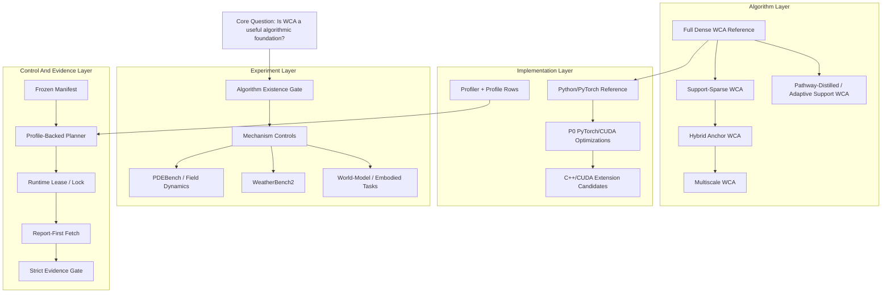
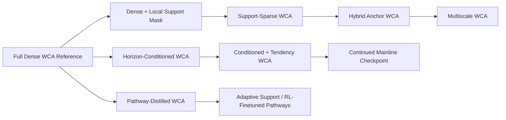

# WCA Macro Architecture And Algorithm Validity Criteria

Date: 2026-06-23

Status: active macro research and execution criteria.

## Purpose

The project has many experiment lines: maze, WeatherBench2, PDEBench, field
dynamics, sparse/hybrid kernels, TS control plane, CUDA optimization, and future
world-model directions. Without a macro architecture and stop criteria, the
work can look busy while failing to answer the central question:

```text
Is WCA itself a useful algorithmic foundation?
```

This document defines the research architecture, what must be proven before
large-scale training, and how to decide what work is next.

## Is WCA Based On GCA?

WCA is not a vanilla GCA if GCA means ordinary Graph Cellular Automata or
standard graph message passing.

WCA can be placed inside the broader generalized cellular automata family:

```text
cells / nodes
  + shared local update rule
  + recurrent state transition
  + graph/grid support
```

But WCA adds a stronger local-world construction:

```text
H: [B, N, D]
  -> each center node c constructs a full local world L_c
L: [B, C=N, N, D]
  -> each local world evolves receiver/sender interactions
  -> local centers are recomposed into H_next
```

Ordinary GCA/GNN:

```text
H_i receives messages from H_j
```

WCA:

```text
inside each center c's local world, L[c, r] receives messages from L[c, s]
```

So the accurate statement is:

```text
WCA is a generalized neural cellular automata architecture with graph/grid
support, but its defining mechanism is local-world recursion rather than
ordinary graph message passing.
```

## Macro Architecture



## Experiment Pyramid V2

The old pyramid jumped too quickly from "model can train" to larger datasets.
The corrected pyramid starts with algorithm validity.

### Level 0: Data And Evaluation Validity

Question:

```text
Are the data splits, labels, metrics, and reports trustworthy?
```

Required:

- no trajectory leakage;
- no frame-window crossing between PDE trajectories;
- fixed analysis plan;
- per-horizon / per-variable / per-seed metrics;
- strict best/final checkpoint reporting;
- raw and aggregated artifacts preserved.

If this fails, no model result is formal evidence.

### Level 1: WCA Algorithm Existence Gate

Question:

```text
Does local-world WCA provide value beyond a generic MLP transition?
```

This must be tested before more large-scale training.

Matched controls:

1. MLP transition with same hidden size and parameter budget.
2. ConvNet/local stencil baseline.
3. ordinary GNN/GCA message passing over H.
4. WCA without local-world L.
5. WCA with L but no receiver/sender pair evolution.
6. Full Dense WCA reference.
7. Support-masked WCA.

Control rules:

- same dataset split;
- same horizon schedule;
- same parameter budget or baseline larger than WCA;
- same optimizer and train steps;
- same seed set;
- same checkpoint rule;
- same report gate.

Minimum evidence:

- WCA beats MLP-only and ordinary GNN/GCA controls on at least one field/PDE
  task under matched budget;
- WCA retains advantage on held-out trajectories;
- improvement is not only from residual/tendency readout, because baselines
  receive the same readout treatment;
- local-world ablations degrade in the expected direction.

Suggested success threshold:

```text
WCA relative_L2 or MSE improves >= 5% over the strongest non-WCA matched
control on best checkpoint and remains non-worse at final checkpoint.
```

If WCA cannot pass Level 1, do not scale WeatherBench2 or world-model tasks.
Return to architecture design.

### Level 2: Mechanism Control

Question:

```text
Which mechanism actually matters?
```

Required ablations:

- full dense vs support-local;
- inner/outer recursion depth;
- residual vs absolute readout;
- horizon conditioning;
- tendency baseline;
- diagnostics off/on;
- chunking/checkpointing as systems-only controls;
- path saliency / support distillation when available.

Pass condition:

The best WCA variant must have an interpretable mechanism story, not only a
single lucky metric.

### Level 3: Generalization

Question:

```text
Does WCA generalize as a CA-like state-space model?
```

Required tests:

- held-out trajectory IDs;
- held-out initial conditions;
- held-out horizon lengths;
- resolution/token-count transfer where feasible;
- autoregressive rollout;
- family-heldout PDE variants when available.

Pass condition:

WCA must not only win direct h8. It must show either:

- stable rollout;
- scale/resolution transfer;
- or better data efficiency than matched baselines.

### Level 4: Scaling And Efficiency

Question:

```text
Does performance improve predictably with capacity and compute?
```

Required:

- width/depth/outer/inner sweep;
- parameter count;
- peak memory;
- samples/sec;
- time-to-best;
- GPU utilization;
- profile rows returned to the planner.

Pass condition:

Increasing capacity should improve quality or stability without pathological
wall-clock/memory growth. If quality does not scale, stop blindly increasing
parameters.

### Level 5: Strong Baseline And World-Model Comparison

Only after Level 1-4 pass, compare against:

- tuned ConvNet / U-Net;
- FNO / neural operator;
- GNN/GCA;
- transformer-like or sequence baseline where appropriate;
- JEPA/V-JEPA-style representation/world-model baselines for representation
  prediction tasks.

Important:

JEPA-style baselines are not drop-in PDE solvers. They should be compared on
representation prediction, latent state forecasting, or downstream planning
metrics, not only pixel/field MSE.

## Mainline Model Tree



Rules:

- Full Dense WCA remains reference.
- Sparse/hybrid/multiscale are not allowed to replace dense reference until
  equivalence or formal variant evidence is available.
- Continued checkpoints form a model lineage. Do not mix them with unrelated
  from-scratch runs in the same table.
- Distillation/RL pathway work is a separate variant family.

## Next Formal Experiment Should Be Level 1

Before another big train, run a focused algorithm-existence experiment:

```text
dataset:
  strict PDEBench reaction-diffusion or a similarly validated field task

models:
  MLP-only transition
  ConvNet/local stencil
  ordinary GNN/GCA over H
  WCA no-local-world ablation
  WCA no-pair-evolution ablation
  Full Dense WCA
  best current mixed-horizon WCA recipe

budget:
  same train/eval split
  same horizon schedule
  same seeds
  same parameter budget, or baselines larger than WCA

metrics:
  MSE
  relative_L2
  per-horizon metrics
  best/final gap
  rollout if feasible
  parameter count
  peak memory
  time-to-best
```

Result interpretation:

- If WCA beats the controls: proceed to mechanism and scaling.
- If only residual/tendency helps all models equally: the win is training
  interface, not WCA.
- If GNN/GCA matches WCA: local-world recursion is not yet justified.
- If WCA only wins h8 but collapses h1/h2/h4, investigate horizon conditioning,
  checkpoint scoring, and mixed-horizon objective imbalance before scaling.

## Acceptance Criteria For Claiming WCA Is Useful

WCA can be claimed useful only when current evidence proves:

1. strict data/eval validity;
2. advantage over matched non-WCA controls;
3. local-world ablations reduce performance;
4. held-out trajectory or horizon generalization;
5. efficiency or parameter advantage, or a clearly superior accuracy/stability
   tradeoff;
6. reproducible manifest, seed, checkpoint, and report artifacts.

Until then, the correct claim is:

```text
WCA is a promising architecture candidate under investigation, not yet a proven
general world-model foundation.
```

## What Not To Do Next

Do not:

- launch broad new SOTA claims before Level 1;
- treat TS planner success as model evidence;
- use a large dataset to hide a failed mechanism control;
- compare WCA to weak baselines only;
- mix pre-fix and post-fix experiment evidence;
- keep adding infra guardrails after O1 unless they unblock a named experiment
  or safety gate.
