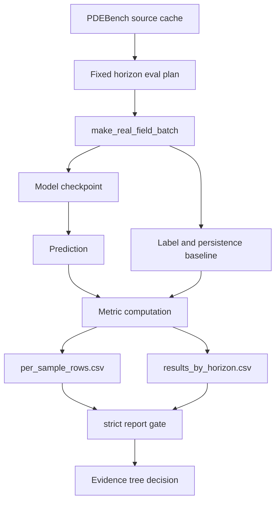

# WCA Eval Attribution And Anti-Cheat Protocol

Date: 2026-06-25

Status: active protocol draft for Stage 2 attribution.

Bucket:

- A. Mainline evidence, when the protocol compares WCA core against matched
  alternatives.
- B. Necessary guardrail, when the protocol blocks false positives caused by
  tokenizer, decoder, checkpoint, sampler, metric, or data leakage.

This document is not a result report. It defines what future evals must prove
before V25b-like learnable-interface results can support claims about the WCA
recursive world-state core.

## 1. Core Question

V25b tests whether a learnable patch interface repairs the short-horizon
weakness of PatchMean WCA.

That is not the same as proving that the WCA core caused the improvement.

The formal question is:

```text
Does the protected Full Dense RWS-NCA core provide attributable predictive
value beyond the tokenizer, decoder, persistence baseline, and checkpoint
selection procedure?
```

The protocol must separate four possible explanations:

1. **WCA core effect**: recursive world-state computation improves prediction.
2. **Interface effect**: tokenizer/decoder captures enough local structure.
3. **Checkpoint effect**: best/final selection or late training instability
   creates a misleading result.
4. **Eval artifact**: sampler, split, horizon, metric, or leakage creates a
   false positive.

## 2. System Position



The eval system is a first-class research subsystem. It is not an appendix to
training.

## 3. Current Eval Modules

### 3.1 Queue Layer

File:

- `artifacts/control/westb_pdebench_v25b_learnable_tokenizer/generated_queue.json`

Responsibilities:

- names the run directories to evaluate;
- calls `scripts/eval_field_horizon_stratified.py`;
- fixes horizons to `1,2,4,8`;
- evaluates `final,best`;
- fixes `eval_samples=64`, `eval_batch_size=1`, `eval_seed=2026062201`;
- writes horizon and per-sample artifacts.

Input:

- trained run directories;
- final and best checkpoints;
- strict PDEBench cache.

Output:

- `results_by_horizon.csv`;
- `results_by_horizon.md`;
- `per_sample_rows.csv`;
- `eval_plan.json`;
- `summary.json`.

### 3.2 Horizon-Stratified Eval Entrypoint

File:

- `scripts/eval_field_horizon_stratified.py`

Key functions:

- `_evaluate_wca_run`;
- `_evaluate_baseline_run`;
- `_validate_matched_eval_plan`;
- `_validate_matched_persistence`;
- `write_csv`;
- `write_per_sample_csv`;
- `main`.

Responsibilities:

- dispatch WCA and baseline runs through their proper evaluators;
- ensure every model in the same horizon uses the same eval plan hash, start
  hash, and sample count;
- ensure persistence MSE matches within each horizon;
- write aggregate and per-sample rows;
- fail closed when strict matched evaluation is not possible.

### 3.3 Fixed Eval Plan

File:

- `scripts/field_eval_plan.py`

Key functions:

- `horizon_eval_seed`;
- `make_fixed_eval_start_indices`;
- `fixed_eval_plan_for_horizons`;
- `attach_fixed_eval_plan`;
- `write_fixed_eval_plan`;
- `eval_plan_hash`;
- `start_indices_hash`.

Responsibilities:

- generate deterministic start indices per horizon;
- use explicit start-index lists rather than relying on shared random seeds;
- serialize hashes so report gates can detect sampler drift.

### 3.4 Batch Construction

File:

- `src/wca/data/field/real_cache.py`

Key function:

- `make_real_field_batch`

Responsibilities:

- load cached PDEBench tensors;
- choose start indices from train/val/test split;
- construct input window and future target;
- produce patch-token labels;
- expose `field_input`, `label`, `field_prediction_baseline`,
  `field_previous_tokens`, `field_start_index`, `field_target_index`, and
  `field_trajectory_id`.

### 3.5 Learnable Interface Model

Files:

- `src/wca/models/field_wca.py`
- `src/wca/models/field_tokenizers.py`

Key classes:

- `FieldTokenizerWCA`;
- `ConvStemTokenizer`;
- `MLPStemTokenizer`;
- `FieldPatchTokenDecoder`.

Responsibilities:

- encode local patch windows into WCA tokens;
- build `H [B,N,D]`;
- inject horizon features and coordinates;
- run the protected `FullRecursiveWorldStateNCA` core unless explicitly
  disabled;
- decode readout tokens into node-wise field channels;
- apply residual readout against the current-token persistence baseline.

### 3.6 Metrics

File:

- `src/wca/data/maze/metrics.py`

Key function:

- `field_metrics`

Responsibilities:

- compute MSE, MAE, relative L2, persistence MSE/MAE, delta MSE/MAE, and
  improvement versus persistence;
- compute per-variable field metrics when labels are multi-channel.

## 4. Anti-Cheat Threat Model

### 4.1 Data Leakage

Risk:

```text
The model sees target/future information before prediction.
```

Guardrails:

- model forward must not read `batch["label"]` or `batch["field_target"]`;
- tokenizer may read `field_input` only;
- target frame may appear only in loss/metrics/report code;
- add static and runtime sentinels that fail if model output changes after
  replacing `label` with random noise while keeping `field_input` fixed.

### 4.2 Interface Attribution Failure

Risk:

```text
Tokenizer/decoder explains the gain, not WCA.
```

Guardrails:

- tokenizer-only run;
- outer_steps=0 run;
- frozen/random core run;
- decoder capacity ladder;
- matched non-WCA models with the same token interface.

### 4.3 Decoder-Capacity False Positive

Risk:

```text
The decoder becomes the useful predictor.
```

Guardrails:

- `field_decoder_width=0,16,64,256` ladder;
- report parameter breakdown: tokenizer/core/decoder;
- require WCA core contribution after controlling decoder size.

### 4.4 Checkpoint Selection Bias

Risk:

```text
Best checkpoint wins while final checkpoint is unstable.
```

Guardrails:

- final remains primary;
- best is diagnostic;
- report `final_minus_best` by horizon;
- repeat with deterministic horizon-stratified checkpoint score.

### 4.5 Sampler And Horizon Drift

Risk:

```text
Different models see different test windows.
```

Guardrails:

- fixed start index per horizon;
- same `eval_plan_hash` and `eval_start_indices_hash` per horizon;
- per-sample rows required;
- report gate rejects missing or mismatched start hashes.

### 4.6 Metric-Only False Positive

Risk:

```text
Aggregate MSE improves while a horizon or sample family collapses.
```

Guardrails:

- primary tables are horizon-stratified;
- pooled averages are secondary;
- per-sample paired deltas are required;
- add paired bootstrap or paired sign-test confidence intervals before formal
  claims.

## 5. Required Attribution Matrix

The next formal attribution loop should include these runs.

| ID | Purpose | Core | Tokenizer | Decoder | Claim If Strong |
|---|---|---|---|---|---|
| A0 | PatchMean WCA reference | WCA | patch_mean | linear/readout | V25 baseline |
| A1 | V25b candidate | WCA | conv_stem | decoder width 64 | Interface + WCA pipeline |
| A2 | V25b candidate | WCA | mlp_stem | decoder width 64 | Interface + WCA pipeline |
| G1 | Tokenizer-only control | none | conv_stem | decoder width 64 | Interface-only capacity |
| G2 | Tokenizer-only control | none | mlp_stem | decoder width 64 | Interface-only capacity |
| G3 | Outer-steps-zero | bypassed | conv_stem | decoder width 64 | No-recursion control |
| G4 | Frozen random core | frozen/random | conv_stem | decoder width 64 | Core-as-random-feature control |
| G5 | Decoder capacity ladder | WCA | conv_stem | 0/16/64/256 | Decoder attribution |
| B1 | Token-equivalent ConvNet | none | same token target | comparable params | Matched baseline |
| B2 | Token-equivalent MLP/FNO | none | same token target | comparable params | Matched baseline |

Promotion rule:

```text
WCA core attribution is allowed only if A1/A2 beat G1/G2/G3/G4 and matched
B-runs under the same split, horizon plan, checkpoint rule, and metric table.
```

## 6. Eval Additions

### 6.1 Label Leakage Sentinel

Add an eval mode that:

1. builds a normal batch;
2. computes prediction;
3. replaces `label` and `field_target` with random tensors;
4. recomputes prediction from the same `field_input`;
5. asserts predictions are unchanged within exact or near-exact tolerance.

Failure means model forward depends on labels or target.

### 6.2 Horizon Shuffle Sentinel

Add an eval mode that shuffles `field_target_steps_actual` while keeping
`field_input` fixed.

Expected behavior:

- horizon-conditioned models should change predictions;
- non-conditioned models should not claim mixed-horizon competence.

### 6.3 Input Shuffle Sentinel

Shuffle `field_input` across samples while keeping labels fixed.

Expected behavior:

- performance should collapse;
- if it does not, model is exploiting target distribution, split leakage, or
  metric/report bugs.

### 6.4 Per-Sample Paired Statistics

Every formal comparison should compute paired rows:

```text
same horizon
same trajectory_id
same start_index
same target_index
model A error
model B error
delta
```

Minimum statistical outputs:

- mean paired delta;
- median paired delta;
- bootstrap confidence interval;
- win rate;
- sign-test p-value or equivalent non-parametric score.

### 6.5 Parameter And Component Accounting

Every horizon row should include:

- total parameter count;
- tokenizer parameter count;
- WCA core parameter count;
- decoder parameter count;
- trainable fraction by component;
- checkpoint kind;
- precision;
- outer steps;
- inner steps.

If this is missing, attribution is incomplete.

## 7. Proposed Next Loop

### V25c: Tokenizer Guardrails

Goal:

```text
Determine whether V25b gains survive tokenizer-only and outer-steps-zero
controls.
```

Runs:

- conv_stem tokenizer-only, seeds 15101/15102;
- mlp_stem tokenizer-only, seeds 15101/15102;
- conv_stem outer_steps=0, seeds 15101/15102;
- mlp_stem outer_steps=0, seeds 15101/15102.

Required eval:

- same `eval_seed=2026062201`;
- same start-index hashes as V25/V25b;
- final and best checkpoints;
- per-sample rows.

Pass condition:

```text
V25b WCA final beats tokenizer-only and outer_steps=0 on h1/h2 without
sacrificing h8 beyond the predeclared tolerance.
```

### V25d: Decoder Capacity And Frozen-Core Guardrails

Goal:

```text
Determine whether decoder capacity or random/frozen core explains the gain.
```

Runs:

- conv_stem WCA with decoder_width 0/16/64/256;
- conv_stem frozen-core;
- conv_stem random-core;
- matched token-equivalent baseline with comparable parameters.

Pass condition:

```text
WCA core remains useful after matching decoder capacity and controlling
random/frozen-core feature effects.
```

### V25e: Eval Sentinel Suite

Goal:

```text
Prove the eval path is not leaking labels, target frames, or sampler drift.
```

Checks:

- label leakage sentinel;
- horizon shuffle sentinel;
- input shuffle sentinel;
- trajectory split audit;
- start-index hash audit;
- per-sample paired-stat report.

Sentinel severity:

- label/target leakage is a hard anti-cheat gate;
- horizon shuffle is a hard anti-cheat gate when the model declares horizon
  conditioning;
- input shuffle is a robustness diagnostic, not a universal hard gate.

Input shuffle must still be reported in every sentinel run. Reports must expose
the numerator and denominator, the affected model families, and the MSE-ratio
distribution. It must not be hidden because it is useful for diagnosing whether
each model family is using node identity, spatial structure, or only token-local
features. It also must not by itself block formal attribution unless the
predeclared analysis plan defines a model-family-specific hard threshold.

Pass condition:

```text
Hard anti-cheat sentinels behave as expected and fail closed when intentionally
corrupted; robustness diagnostics are explicitly reported and interpreted.
```

## 8. Formal Claim Rules

Allowed claim after V25b only:

```text
The learnable field interface may improve the WCA pipeline.
```

Not yet allowed:

```text
The WCA core caused the improvement.
```

Allowed claim after V25c/V25d/V25e pass:

```text
The WCA recursive world-state core contributes attributable value beyond the
learnable interface and checkpoint/eval artifacts on this PDEBench task.
```

Still not allowed without Stage 3 and Stage 4:

```text
WCA is a general world model.
WCA is SOTA.
WCA will scale predictably across tasks.
```

## 9. Implementation Boundaries

Allowed near-term code areas:

- `scripts/eval_field_horizon_stratified.py`;
- `scripts/report_v20_pdebench.py`;
- `scripts/audit_model_ladder.py`;
- `scripts/field_eval_plan.py`;
- `tests/test_field_horizon_stratified_eval.py`;
- `tests/test_field_tokenizers.py`;
- `configs/control/v25c/*`;
- `configs/control/v25d/*`;
- `configs/control/v25e/*`;
- read-only updates to docs that point to this protocol.

Forbidden in attribution loops:

- changing `FullRecursiveWorldStateNCA` math;
- changing target labels;
- changing PDEBench split;
- silently changing patch size or token count;
- changing primary checkpoint from final to best;
- removing per-sample rows;
- using pooled averages as the primary endpoint.

## 10. Acceptance Criteria

This protocol is satisfied when:

1. V25b results are fetched and classified as pipeline evidence, not core
   attribution evidence.
2. V25c/V25d/V25e manifests are generated with strict start-index reuse.
3. All guardrail runs produce `results_by_horizon.csv`, `per_sample_rows.csv`,
   `eval_plan.json`, and `summary.json`.
4. Report gates reject missing or mismatched start hashes.
5. A paired statistical report exists for every formal WCA-vs-control claim.
6. The final conclusion states whether each gain is attributed to:
   - WCA core;
   - tokenizer;
   - decoder;
   - checkpoint selection;
   - eval artifact;
   - unresolved.

## 11. Open Design Questions

These are not blockers for V25c, but they must be resolved before larger
claims:

1. Should token-equivalent baselines use the exact same learnable tokenizer or
   an independently parameter-matched tokenizer?
2. Should decoder capacity be matched by parameter count or by wall-clock
   budget?
3. Should paired statistics use bootstrap, sign-test, or both?
4. Should formal tables require multiple datasets before reporting a promoted
   WCA core claim?
5. Should the eval sentinel suite run on every future queue or only on promoted
   model families?
